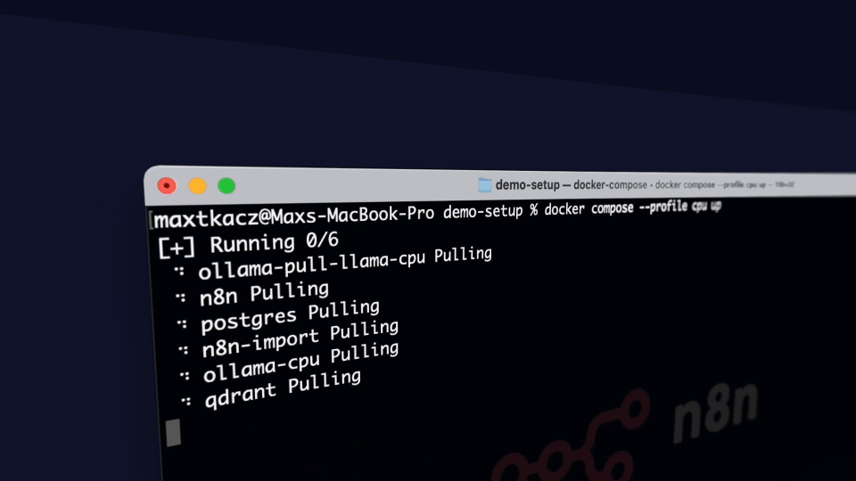

# CP Agentic MCP Playground

A self-hosted lab for building AI agents (n8n, Flowise, Langflow, Open WebUI) over Check Point MCP servers, with Langfuse tracing — brought up with a single `docker compose up`.

Part of the [Dev Hub](https://github.com/alshawwaf/dev-hub) ecosystem — deploy the whole suite with [ubuntu-dokploy-ai](https://github.com/alshawwaf/ubuntu-dokploy-ai).

<p align="left">
  
  
  
  
  
  
  
</p>

---

## Overview

The CP Agentic MCP Playground is a multi-service Docker Compose stack that stands up a complete
**Agentic AI + Check Point** environment: three low-code agent builders, a chat UI, local LLMs,
an AI red-teaming platform, full request tracing, and a fleet of **Check Point MCP (Model Context
Protocol) servers** exposed as HTTP sidecars — fronted by a single MCP gateway.

The point is a **single lab stack** for building, testing, and demoing AI agents that operate
Check Point products (Quantum Management, Gaia, gateway CLI, logs, threat prevention/emulation,
reputation, HTTPS inspection, CPInfo, policy insights, and more). Everything is provisioned and
seeded automatically — the instance owners are created for you, and example agents are imported
into all three builders on every deploy.

Built for **lab and demo** use. See [Deployment](#deployment) and the
[Production Deployment Guide](docs/operations/PRODUCTION_DEPLOYMENT.md) before exposing it more widely.

## What's in the stack

| Component | Image / tag | Role |
|-----------|-------------|------|
| **n8n** | `n8nio/n8n:2.28.6` | Workflow automation + agent builder (native MCP Client Tool node) |
| **PostgreSQL** | `postgres:16-alpine` | Backing store for n8n, Langfuse, and (optionally) Flowise |
| **Ollama** | `ollama/ollama:0.31.1` | Local LLM server — CPU by default, NVIDIA GPU via profile |
| **Open WebUI** | `ghcr.io/open-webui/open-webui` | Chat UI for Ollama, with an n8n pipe |
| **Flowise** | `flowiseai/flowise` | Low-code LLM/agent builder — **native** Langfuse tracing |
| **Langflow** | `langflowai/langflow:1.10.1` | Visual AI flow builder |
| **Langfuse** | `langfuse/langfuse:2` | LLM observability / tracing UI (`trace.<domain>`) |
| **LiteLLM** | `berriai/litellm` | Internal OpenAI-compatible proxy — routes n8n + Langflow → Langfuse |
| **Qdrant** | `qdrant/qdrant:v1.12.4` | Vector DB for the Visible RAG demo |
| **AI-Infra-Guard** | built from [Tencent/AI-Infra-Guard](https://github.com/Tencent/AI-Infra-Guard) | AI red-teaming: MCP security scan + jailbreak eval (`aig.<domain>`) |
| **MCP sidecars** | `custom-mcp-n8n:custom` | 14 Check Point MCP servers as internal HTTP services |
| **MCP Gateway** | `docker/mcp-gateway` | Aggregates the MCP fleet behind one Bearer-auth endpoint |

One-shot helpers run on every `docker compose up` and then exit: `n8n-provision` (creates the n8n
owner), `n8n-import` / `builders-import` (seed agents into n8n / Flowise / Langflow),
`openwebui-provision` (claims the Open WebUI admin), `*-db-init` (create the `langfuse` / `flowise`
databases), `rag-ingest` (embed the RAG corpus into Qdrant), and `ollama-pull-models-*` (pull the
configured models).

## Features

- **Three agent builders, pre-seeded.** n8n ships 34 example workflows; Flowise and Langflow each
  ship 32 importable agent flows. Agents come in three shapes: **gateway** (through the MCP
  gateway), **direct** (a single MCP sidecar), and **external** (DevHub / PolicyPilot / SCIM IdP
  endpoints). Seeding is idempotent — a same-named flow is never imported twice.
- **14 Check Point MCP servers** over HTTP, plus a **Docker MCP Gateway** that fronts 11 of them
  behind a single Bearer-authenticated endpoint (`http://mcp-gateway:8080/mcp`).
- **End-to-end tracing.** Every Flowise run traces natively to Langfuse; n8n and Langflow route
  their model calls through the LiteLLM proxy, which logs each call to Langfuse.
- **Local, private LLMs** via Ollama (CPU or NVIDIA GPU), with a small default model set and an
  embedding model for RAG.
- **Guardrails demo** — a Lakera Guard agent that blocks prompt injection before it reaches a tool.
- **Visible RAG** — a one-shot ingester embeds a small Check Point corpus into Qdrant; an n8n agent
  retrieves and cites it.
- **Evals harness** — replay scored chat cases against the agents' webhooks.
- **Teaching labs** — "Build Your Own MCP Server" (zero-dependency) and an **intentionally
  vulnerable** MCP server for attack/defend exercises (both opt-in).
- **Zero-touch provisioning** — owners, admins, credentials, databases, and agents are all created
  automatically on deploy.

## Screenshots



Guide walkthroughs include step-by-step node screenshots — see the
[Lakera Playground Guide](docs/guides/n8n_Lakera_Playground_Guide.md).

## Quick start

**Requirements:** Docker Engine + Docker Compose v2, outbound Internet from containers (image pulls,
Ollama model pulls). For the GPU profile: an NVIDIA GPU with the NVIDIA Container Toolkit
(`nvidia-smi` working on the host).

```bash
# 1. Generate a .env with secure secrets (or copy .env-example yourself)
./setup.sh

# 2. Build the custom n8n image (bakes in the Check Point MCP CLIs)
docker compose build n8n

# 3. Start the core CPU stack
docker compose up -d
```

Wait 30–60 s for Postgres, n8n, the provisioners, and the importers to settle, then browse to n8n.
Log in with the owner credentials from `.env`. The core stack (n8n, Postgres, Ollama CPU, Open
WebUI, Flowise, Langflow, Langfuse, LiteLLM, Qdrant, all MCP sidecars, the gateway) has **no
profile and always runs**.

**GPU Ollama** instead of CPU:

```bash
docker compose --profile gpu-nvidia up -d
```

Set a default profile to avoid repeating it: `export COMPOSE_PROFILES=gpu-nvidia`.

> **No host ports are bound by default.** Services are reached through Traefik at their subdomains
> (see [Deployment](#deployment)). To reach a service directly on a plain host, add a temporary
> `ports:` mapping to that service in `docker-compose.yml`, or `docker compose exec` into it.

### Profiles

The core stack is profile-less. Everything below is strictly opt-in (comma-separated in
`COMPOSE_PROFILES`):

| Profile | Adds | Guide |
|---------|------|-------|
| `gpu-nvidia` | GPU Ollama (run instead of CPU Ollama) | — |
| `exercises` | `ips-cve-mcp` — the "Build Your Own MCP" IPS/CVE sidecar | [Build Your Own MCP](docs/guides/Build_Your_Own_MCP_Exercise.md) |
| `security-lab` | `vuln-mcp` — an **intentionally vulnerable** MCP server (simulated, no host port) | [MCP Security Lab](docs/guides/MCP_Security_Lab.md) |
| `policypilot` | `policypilot-mcp` — [PolicyPilot](https://github.com/alshawwaf/PolicyPilot)'s guarded-WRITE MCP server | [PolicyPilot behind the Gateway](docs/guides/PolicyPilot_Gateway_Sidecar_Guide.md) |

The `evals-run` one-shot is not a profile — start it explicitly with `docker compose up evals-run`
([Evals Harness](docs/guides/Evals_Harness.md)). The legacy `cpu` value is a harmless no-op.

## Deployment

On the lab host this repo is deployed automatically by
[ubuntu-dokploy-ai](https://github.com/alshawwaf/ubuntu-dokploy-ai) on bare-metal Ubuntu +
[Dokploy](https://dokploy.com), where **Traefik** provides ingress and **Let's Encrypt** provides
TLS. There is no separate `docker-compose.dokploy.yml` — the routing lives as Traefik labels in
`docker-compose.yml`, and the web services join the external `dokploy-network`.

Published subdomains (set `DOMAIN` in `.env`):

| Service | URL |
|---------|-----|
| n8n | `https://n8n.<domain>` (routed by the host's Dokploy workflow) |
| Open WebUI | `https://chat.<domain>` |
| Flowise | `https://flowise.<domain>` |
| Langflow | `https://langflow.<domain>` |
| Langfuse | `https://trace.<domain>` |
| AI-Infra-Guard | `https://aig.<domain>` |

Ollama, the MCP sidecars, the gateway, LiteLLM, and Qdrant are **internal-only** on the private
`demo` network (no host port, no route). Langflow, Langfuse, and AI-Infra-Guard carry framing
middleware so the [Dev Hub](https://github.com/alshawwaf/dev-hub) desktop can embed them in a window.

You can still run the whole thing standalone with `docker compose up`; without a `DOMAIN` the Host
rules degrade harmlessly and you reach services via `exec`/a temporary port mapping.

## MCP servers

The 14 Check Point MCP sidecars run from the custom n8n image and listen on the internal `demo`
network only. From an **n8n MCP HTTP node** (or any in-network client) use the service name — set
**Connection Type** to `http` and **Base URL** to `http://<service>:<port>`; do **not** set a
Package/Command field.

| Service | URL | Fronted by gateway |
|---------|-----|:---:|
| Documentation | `http://mcp-documentation:3000` | ✅ |
| HTTPS Inspection | `http://mcp-https-inspection:3001` | ✅ |
| Quantum Management | `http://mcp-quantum-management:3002` | ✅ |
| Management Logs | `http://mcp-management-logs:3003` | ✅ |
| Threat Emulation | `http://threat-emulation-mcp:3004` | ✅ |
| Threat Prevention | `http://threat-prevention-mcp:3005` | ✅ |
| Spark Management | `http://spark-management-mcp:3006` | |
| Reputation Service | `http://reputation-service-mcp:3007` | ✅ |
| Harmony SASE | `http://harmony-sase-mcp:3008` | |
| Quantum GW CLI | `http://quantum-gw-cli-mcp:3009` | ✅ |
| GW Connection Analysis | `http://quantum-gw-connection-analysis-mcp:3010` | |
| Quantum Gaia | `http://quantum-gaia-mcp:3011` | ✅ |
| CPInfo Analysis | `http://cpinfo-analysis-mcp:3012` | ✅ |
| Policy Insights | `http://policy-insights-mcp:3013` | ✅ |

### MCP Gateway

The [Docker MCP Gateway](docs/guides/MCP_Gateway_Explained.md) aggregates 11 of the sidecars behind
one endpoint at `http://mcp-gateway:8080/mcp` (Streamable-HTTP), authenticated with a **Bearer
token** (`MCP_GATEWAY_TOKEN`). The token is pinned so it survives redeploys — otherwise the gateway
mints a new one on each restart and invalidates every client credential. The servers it fronts are
listed in [`mcp-gateway/catalog.yaml`](mcp-gateway/catalog.yaml). See the
[MCP Gateway Agent Guide](docs/guides/MCP_Gateway_Agent_Guide.md) for direct-sidecar vs. gateway agents.

The vendored MCP servers carry a local patch giving each Streamable-HTTP session its own server
instance — required for fronting them with a gateway (stock packages are single-client). See
[`docker/n8n/mcp-src/PATCHES.md`](docker/n8n/mcp-src/PATCHES.md); built npm tarballs are attached to
the repo's GitHub Releases.

## Agents & flows

Example agents are committed in the repo and re-seeded into the running builders on every deploy.

- **n8n** (`n8n/backup/workflows/`) — imported by the `n8n-import` one-shot, which substitutes
  secrets from `.env` and resolves the `{{DOMAIN}}` placeholder. Each direct MCP agent also ships a
  `*-via-gateway` twin. Committed files carry placeholders only — **never real secrets**.
- **Flowise + Langflow** (`integrations/flowise/`, `integrations/langflow/`) — imported by the
  `builders-import` one-shot ([`integrations/README.md`](integrations/README.md)). Each builder gets
  32 flows: gateway, direct-sidecar, and external-endpoint variants, catalogued in
  [`integrations/builders_agents.json`](integrations/builders_agents.json). **No manual API keys
  required** — the importer authenticates with the stack admin account (Flowise first-setup /
  Langflow superuser).
- **Code-first agent** (`integrations/code-agent/`) — the graduation path from low-code to plain
  Python, hitting the exact same gateway (stdlib-only, no PyPI deps).

## Observability

Langfuse (v2, single Postgres-backed container) gives every agent run a trace: prompts, tool calls,
token counts, latency, and cost where reported. Flowise traces **natively**. n8n and Langflow have
no callback that works against the lean v2 server, so their model calls go through the **LiteLLM**
proxy (`http://litellm:4000`, OpenAI-compatible), which forwards to the real provider and logs each
call to Langfuse. Open the UI at `trace.<domain>`. See
[Observability with Langfuse](docs/guides/Observability_Langfuse.md).

## Ollama models

The `ollama-pull-models-*` sidecar pulls the comma-separated `OLLAMA_MODELS` on startup (default:
`gemma4:e2b,qwen3.5:4b,nomic-embed-text` — a small chat model, a light tool-calling model, and the
RAG embedder). The `.env-example` lists a heavier full-demo set for GPU boxes. Change the models by
editing `OLLAMA_MODELS`; inspect or prune inside the container with `ollama list` / `ollama rm`.

## Configuration

Run `./setup.sh` to generate a `.env` from [`.env-example`](.env-example) (optionally with random
secrets). The variable names must match what `docker-compose.yml` reads — `.env-example` is the
authoritative, fully-commented template. Key variables:

| Variable | Purpose |
|----------|---------|
| `DOMAIN` | Base domain for the Traefik Host routers (`<sub>.${DOMAIN}`); leave blank for purely local runs |
| `POSTGRES_USER` / `POSTGRES_PASSWORD` / `POSTGRES_DB` | Postgres (n8n DB; Langfuse/Flowise DBs are created alongside) |
| `N8N_ENCRYPTION_KEY` / `N8N_USER_MANAGEMENT_JWT_SECRET` | n8n secrets — must match across all n8n containers |
| `N8N_ADMIN_*` / `N8N_BASIC_AUTH_*` | n8n owner (used by the provisioner) and basic-auth pair |
| `OLLAMA_MODELS` | Comma-separated models pulled on startup |
| `LANGFLOW_AUTO_LOGIN` | `true` = no-login demo; `false` (default) = login required |
| `NEXTAUTH_SECRET` / `SALT` / `LANGFUSE_ENCRYPTION_KEY` | Langfuse secrets (`gen_secrets.py` can generate them) |
| `LANGFUSE_PUBLIC_KEY` / `LANGFUSE_SECRET_KEY` | Project keys the builders send with traces |
| `LITELLM_MASTER_KEY` | Auth for the internal LiteLLM proxy |
| `MCP_GATEWAY_TOKEN` | Pinned Bearer token for the MCP gateway |
| `DOC_CLIENT_ID` / `DOC_SECRET_KEY` / `DOC_REGION` | Documentation MCP (Infinity Portal) |
| `MANAGEMENT_HOST` / `MANAGEMENT_API_KEY` | SMS host + API key backing the management-family MCP servers |
| `TE_API_KEY` / `REPUTATION_API_KEY` | Threat Emulation / Reputation service keys |
| `GAIA_GATEWAY_IP` / `GAIA_USERNAME` / `GAIA_PASSWORD` | Gaia OS agent → a gateway's Gaia REST API |
| `SPARK_MGMT_*` / `HARMONY_SASE_*` | Spark Management / Harmony SASE MCP creds |
| `OPENAI_API_KEY` / `AZURE_OPENAI_API_KEY` / `GEMINI_API_KEY` / `ANTHROPIC_API_KEY` | Bring-your-own chat-model keys, injected into the matching agent credential at import |
| `LAKERA_API_KEY` / `LAKERA_PROJECT_ID` | Lakera Guard (guardrails demos) |
| `IDP_SCIM_TOKEN` / `DEVHUB_MCP_TOKEN` / `PILOT_MCP_TOKEN` | Bearer tokens for the external SCIM / DevHub / PolicyPilot agents |
| `AIG_LLM_*` | AI-Infra-Guard's LLM (defaults to local Ollama) |
| `COMPOSE_PROFILES` | Opt-in profiles (see [Profiles](#profiles)) |

> Only populate the MCP variables for the services you actually use. `MANAGEMENT_HOST` +
> `MANAGEMENT_API_KEY` back several sidecars (HTTPS Inspection, Quantum Management, Management Logs,
> Threat Prevention, Policy Insights). Committed agent/credential files carry placeholders — real
> values are injected at import time and dropped if the corresponding env is empty.

## Data & persistence

Named Docker volumes let you destroy containers and keep data:

| Volume | Contents |
|--------|----------|
| `n8n_storage` | n8n config / user data |
| `postgres_storage` | PostgreSQL (n8n, Langfuse, optional Flowise) |
| `ollama_storage` | Ollama models |
| `open-webui` | Open WebUI data |
| `flowise` | Flowise data (SQLite default) |
| `langflow` | Langflow data |
| `qdrant_storage` | Qdrant vectors (RAG) |
| `aig_data` / `aig_db` / `aig_logs` / `aig_uploads` | AI-Infra-Guard state |
| `policypilot_data` | PolicyPilot MCP DB (opt-in profile) |

Full reset (fresh DB, no workflows/credentials/history): `docker compose down -v && docker compose up -d`.
See the [Backup & Recovery Guide](docs/operations/BACKUP_RECOVERY.md) and `scripts/backup-volumes.sh`.

## Tech stack

Docker Compose · n8n · Flowise · Langflow · Open WebUI · Ollama · PostgreSQL 16 · Langfuse ·
LiteLLM · Qdrant · Docker MCP Gateway · Check Point `@chkp/*` MCP servers · AI-Infra-Guard ·
Traefik + Let's Encrypt (via Dokploy) · Python (stdlib-only integration scripts).

## Development

```bash
# Rebuild the custom n8n image (after changing MCP CLI versions or Dockerfile)
docker compose build --pull n8n     # do NOT `docker compose pull n8n` — it's a local image

# Health check / env validation
./scripts/health-check.sh
./scripts/validate-env.sh

# Integration tests (also run in CI on every push/PR)
./tests/integration-test.sh
```

CI/CD lives in `.github/workflows/` (`ci.yml`, `security-scan.yml`). Repo layout and internals are
documented in [docs/development/](docs/development/) (`DEVELOPER_GUIDE.md`, `DIRECTORY_STRUCTURE.md`).

## Guides

- [MCP Gateway — Explained](docs/guides/MCP_Gateway_Explained.md) and the
  [MCP Gateway Agent Guide](docs/guides/MCP_Gateway_Agent_Guide.md) — direct sidecar vs. gateway agents.
- Per-server agent guides: [Quantum Management](docs/guides/Quantum_Management_MCP_Agent_Guide.md),
  [Gaia OS](docs/guides/Quantum_Gaia_MCP_Agent_Guide.md),
  [Gateway CLI](docs/guides/Quantum_Gateway_CLI_MCP_Agent_Guide.md),
  [Management Logs](docs/guides/Management_Logs_MCP_Agent_Guide.md),
  [Threat Prevention](docs/guides/Threat_Prevention_MCP_Agent_Guide.md),
  [Threat Emulation](docs/guides/Threat_Emulation_MCP_Agent_Guide.md),
  [Reputation](docs/guides/Reputation_Service_MCP_Agent_Guide.md),
  [HTTPS Inspection](docs/guides/HTTPS_Inspection_MCP_Agent_Guide.md),
  [CPInfo Analysis](docs/guides/CPInfo_Analysis_MCP_Agent_Guide.md),
  [Documentation](docs/guides/Documentation_MCP_Agent_Guide.md).
- [Lakera Guardrails Playground](docs/guides/n8n_Lakera_Playground_Guide.md) ·
  [Observability with Langfuse](docs/guides/Observability_Langfuse.md) ·
  [Visible RAG](docs/guides/Visible_RAG.md) ·
  [Evals Harness](docs/guides/Evals_Harness.md) ·
  [MCP Security Lab](docs/guides/MCP_Security_Lab.md).
- [Build Your Own MCP Server](docs/guides/Build_Your_Own_MCP_Exercise.md) ·
  [Identity Provisioning (SCIM)](docs/guides/Identity_Provisioning_SCIM_Agent_Guide.md) ·
  [PolicyPilot behind the Gateway](docs/guides/PolicyPilot_Gateway_Sidecar_Guide.md) ·
  [Capstone: Zero-Trust Onboarding](docs/guides/Capstone_Zero_Trust_Onboarding.md).
- Operations: [Production Deployment](docs/operations/PRODUCTION_DEPLOYMENT.md) ·
  [Backup & Recovery](docs/operations/BACKUP_RECOVERY.md).

## Troubleshooting

| Symptom | Fix |
|---------|-----|
| `n8n-import`: "Mismatching encryption keys" | Use the same `N8N_ENCRYPTION_KEY` across `n8n`, `n8n-import`, `n8n-provision`. |
| MCP node shows `@chkp/... ERR_MODULE_NOT_FOUND` | The node is in package mode — switch it to **HTTP** and point at `http://<service>:<port>`. |
| Can't reach an MCP server | From inside the network use the **service name**, not `localhost`: `docker compose exec n8n sh` → `curl http://mcp-documentation:3000/`. |
| Gateway exposes 0 tools | A sidecar wasn't listening when the gateway enumerated. Healthchecks gate this; restart the gateway if it wedged. |
| GPU not detected | Use the `gpu-nvidia` profile and verify `docker run --rm --gpus all nvidia/cuda:12.3.2-base nvidia-smi`. |
| Provisioner: HTTP 400 "already installed/registered" | Normal on re-runs — the one-shots are idempotent. |

## Security notes

Built for lab and demo use. Always run `./setup.sh` for strong random secrets, never commit `.env`,
and keep API keys to environments you trust. This stack is designed for a private/isolated network;
apply the hardening in the [Production Deployment Guide](docs/operations/PRODUCTION_DEPLOYMENT.md)
before wider exposure. The `security-lab` profile is **intentionally vulnerable** and must stay off
outside the teaching exercise.

## License

[MIT](LICENSE) © Check Point Software Technologies Ltd.
