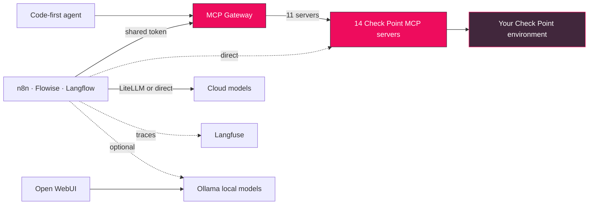

<div align="center">

# Check Point Agentic MCP Playground

**A self-hosted lab for building, tracing, and securing GenAI agents on Check Point MCP servers.**

[](LICENSE) [](docker-compose.yml) [](docs/REFERENCE.md#version-pins)
[](docs/REFERENCE.md#version-pins) [](docs/REFERENCE.md#stack-components) [](docs/REFERENCE.md#mcp-servers)

[Quick start](#quick-start) · [Learning path](#learning-path) · [Lab to production](#from-lab-to-production) · [Reference](docs/REFERENCE.md)

</div>

One Docker Compose stack gives you three agent builders, a chat UI, models, tracing, and 14 Check Point MCP servers. MCP, the Model Context Protocol, is an open standard for how AI agents call tools. Every agent is seeded on each deploy, so you start by chatting, not wiring. The lab suits sales engineers, trainers, and developers who want hands-on GenAI practice.

## What you get

| Part | What ships |
|---|---|
| **Agent builders** | n8n 2.40.7 with 34 workflows, Langflow 1.10.1 with 33 flows, and Flowise with the same 33 flows |
| **MCP servers for Management and gateways** | Nine: Management, Management Logs, Policy Insights, Threat Prevention, HTTPS Inspection, CPInfo Analysis, Gaia, Gateway CLI, and Gateway Connection Analysis |
| **MCP servers for Check Point services** | Five, each with its own credentials: Documentation, Threat Emulation, Reputation Service, Spark Management, and SASE |
| **MCP Gateway** | One endpoint for 11 of the 14 servers, protected by a shared token |
| **Models and tracing** | Local models on Ollama, chat in Open WebUI v0.11.4, a LiteLLM proxy for cloud models, and Langfuse v2 traces |
| **Quality and safety** | Visible RAG on Qdrant, an evals harness, Lakera Guard agents, AI-Infra-Guard red teaming, and opt-in labs |


```mermaid
flowchart LR
  K["Code-first agent"] --> G["MCP Gateway"]:::cp
  B["n8n · Flowise · Langflow"] -->|"shared token"| G
  G -->|"11 servers"| S["14 Check Point MCP servers"]:::cp
  B -.->|"direct"| S
  S --> E["Your Check Point environment"]:::env
  B -->|"LiteLLM or direct"| M["Cloud models"]
  B -.->|"traces"| T["Langfuse"]
  B -.->|"optional"| O["Ollama local models"]
  W["Open WebUI"] --> O
  classDef cp fill:#EE0C5D,stroke:#41273C,color:#FFFFFF
  classDef env fill:#41273C,stroke:#EE0C5D,color:#FFFFFF
```

## Quick start

**On a lab host (recommended).** Run the one-command installer from [ubuntu-dokploy-ai](https://github.com/alshawwaf/ubuntu-dokploy-ai). It installs Dokploy and Traefik, sets up routing and TLS, generates the secrets, and deploys this repo. You need:

- An Ubuntu 22.04 or 24.04 amd64 server with root access.
- A domain with a wildcard DNS `A` record (`*.<domain>`) for the server, and ports 80 and 443 open. Behind NAT, use `--ingress tunnel` with a Cloudflare-hosted domain instead.
- Your keys in the installer's `answers.env`, plus an `N8N_ADMIN_PASSWORD` that follows the rule below. The one the installer generates [fails the Flowise check](docs/REFERENCE.md#admin-password).

**On any other Docker host.** You need Docker Compose v2, Python 3, and outbound Internet access.

- The prebuilt images are amd64 only. On Apple Silicon, turn on Rosetta in Docker Desktop and run `export DOCKER_DEFAULT_PLATFORM=linux/amd64` first.
- On macOS, run `cp .env-example .env` instead of `setup.sh`, then replace the training defaults by hand ([why](docs/REFERENCE.md#setupsh)).
- No host ports are published. To browse from the same machine, add the [local port override](docs/REFERENCE.md#running-on-a-plain-docker-host).

```bash
git clone https://github.com/alshawwaf/cp-agentic-mcp-playground.git
cd cp-agentic-mcp-playground
./setup.sh -y                           # Linux: creates .env with random secrets
python3 integrations/observability/gen_secrets.py --with-keys
# Paste that output over the blank Langfuse lines in .env, then set the values below
docker network create dokploy-network   # compose expects this external network
docker compose up -d                    # the first start pulls images and models
docker compose ps -a n8n-import builders-import   # wait until both show Exited (0)
docker compose restart n8n              # first run only: registers the chat webhooks
```

**Seeded on every deploy.** One-shot importers load the example agents into each app:

| App | Seeded by | What it loads |
|---|---|---|
| n8n | `n8n-import` | 34 workflows and 12 credentials, then activates the workflows |
| Flowise | `builders-import` | 33 flows, the admin account, a credential per model key, and Langfuse tracing |
| Langflow | `builders-import` | The same 33 flows, with model keys as global variables |
| Open WebUI | `openwebui-provision` | The admin account only. No agents ship for Open WebUI |

n8n re-imports by workflow ID, so each deploy replaces your edits to a seeded workflow. Save a copy under a new name first. Flowise and Langflow skip any flow that already exists, so your edits stay.

| Set in `.env` | What it does |
|---|---|
| `N8N_ADMIN_PASSWORD` | The shared admin login: 8 to 64 characters, with upper- and lowercase letters, a digit, and one of `-_.!@%`. n8n and Flowise reject anything weaker, and seeding fails. `setup.sh -y` makes one that fits |
| `MANAGEMENT_HOST`, `MANAGEMENT_API_KEY` | The nine Management and gateway MCP servers. Gaia also needs `GAIA_*`. The other five take [their own credentials](docs/REFERENCE.md#mcp-servers) |
| `AZURE_OPENAI_API_KEY`, `AZURE_OPENAI_ENDPOINT` | The default model for n8n agents. Add the endpoint line yourself. The Azure deployment must be named `gpt-5.4-2026-03-05` |
| `OPENAI_API_KEY` | The default model for Flowise and Langflow flows. Other providers are in [model keys](docs/REFERENCE.md#chat-models-and-provider-keys) |
| `OPEN_WEBUI_ADMIN_EMAIL`, `OPEN_WEBUI_ADMIN_PASSWORD` | The Open WebUI admin. Add both lines yourself. Without them, the first person to sign up becomes admin |

**Sign in.** n8n, Flowise, Langflow, and Langfuse share one account: `N8N_ADMIN_EMAIL` and `N8N_ADMIN_PASSWORD`. On the lab host, the generated passwords are in `/etc/dokploy-ai/secrets.env`.

| App | Address on the lab host |
|---|---|
| n8n | `https://n8n.<domain>` |
| Flowise | `https://flowise.<domain>` |
| Langflow | `https://langflow.<domain>` |
| Langfuse | `https://trace.<domain>` |
| Open WebUI | `https://chat.<domain>` |
| AI-Infra-Guard | `https://aig.<domain>` |

**First chat.** Every builder has the agent `CP Quantum Management — AI Agent (Gateway)`. With the Management key set, open it in n8n (needs the Azure key) and click **Open chat**, or in Flowise or Langflow (needs `OPENAI_API_KEY`). With no keys yet, chat with a local model in Open WebUI.

> [!WARNING]
> This is a lab. The n8n chat endpoints are public, several defaults are published training values, and the `security-lab` profile is intentionally vulnerable. Read the [security notes](docs/REFERENCE.md#security-notes) before you share a URL.

## Learning path

| Step | Guide | You will | Needs |
|---|---|---|---|
| 1 | [MCP Gateway, Explained](docs/guides/MCP_Gateway_Explained.md) | Learn what the gateway does, then call it with curl | Nothing extra |
| 2 | [Management agent](docs/guides/Quantum_Management_MCP_Agent_Guide.md), or any [per-server guide](docs/REFERENCE.md#guides-index) | Query your security policy in plain language | That product's keys and a model key |
| 3 | [Direct vs. gateway](docs/guides/MCP_Gateway_Agent_Guide.md) | Compare a direct agent with its gateway twin | Same as step 2 |
| 4 | [Tracing with Langfuse](docs/guides/Observability_Langfuse.md) | Follow each model call in a trace | The Langfuse keys from the quick start |
| 5 | [Lakera Playground](docs/guides/n8n_Lakera_Playground_Guide.md) | Screen prompts and answers with Lakera Guard | `LAKERA_API_KEY`, `GEMINI_API_KEY` |
| 6 | [Visible RAG](docs/guides/Visible_RAG.md), then [Evals](docs/guides/Evals_Harness.md) | Ground answers in documents, then score the agents | A model key. One eval case also needs `LAKERA_API_KEY` |
| 7 | [Build Your Own MCP Server](docs/guides/Build_Your_Own_MCP_Exercise.md) | Write a server and add it to the gateway | `exercises` profile, `IPS_CLIENT_ID`, `IPS_ACCESS_KEY` |
| 8 | [MCP Security Lab](docs/guides/MCP_Security_Lab.md) | Attack, detect, and defend an MCP server | `security-lab` profile |
| 9 | [SCIM provisioning](docs/guides/Identity_Provisioning_SCIM_Agent_Guide.md) and [PolicyPilot](docs/guides/PolicyPilot_Gateway_Sidecar_Guide.md) | Create users and grant access from a chat | The [IdP simulator](https://github.com/alshawwaf/SAML_IDP_Simulator), `IDP_SCIM_TOKEN`, `PILOT_*`, and a local PolicyPilot image |
| 10 | [Capstone: Zero Trust Onboarding](docs/guides/Capstone_Zero_Trust_Onboarding.md) | Chain identity, access, and guardrails end to end | `LAKERA_API_KEY` and the setup from step 9 |

Some guides predate the current n8n nodes and the 11-server gateway. The [guides index](docs/REFERENCE.md#guides-index) lists the known gaps.

## From lab to production

| Path | What it shows |
|---|---|
| [Code-first agent](integrations/code-agent/README.md) | Two dependency-free Python scripts call the same gateway: a raw MCP client and an Anthropic tool loop |
| [Amazon Bedrock AgentCore](https://github.com/alshawwaf/checkpoint-mcp-on-aws-agentcore) | Up to 15 Check Point MCP servers, each on its own AgentCore Runtime. By default, nine are deployed behind one authenticated gateway for a Claude agent on Bedrock |
| [Microsoft Foundry](https://github.com/alshawwaf/checkpoint-mcp-on-azure-foundry) | The same 15 servers run as stdio child processes of a local or hosted Foundry agent. It uses Key Vault and Entra ID. There is no gateway by default. An opt-in `--remote-mcp` tier fills that role |

## Reference

[`docs/REFERENCE.md`](docs/REFERENCE.md) holds the detail: [components](docs/REFERENCE.md#stack-components), [profiles](docs/REFERENCE.md#compose-profiles), [routing](docs/REFERENCE.md#deployment-and-routing), [configuration](docs/REFERENCE.md#configuration), [volumes and backups](docs/REFERENCE.md#data-volumes), [troubleshooting](docs/REFERENCE.md#troubleshooting), [upgrades](docs/REFERENCE.md#upgrading-n8n-and-open-webui), and [related repositories](docs/REFERENCE.md#related-repositories).

## License

[MIT](LICENSE) © 2025 Check Point Software Technologies Ltd. Bundled third-party components keep their own [licenses](docs/REFERENCE.md#license).
