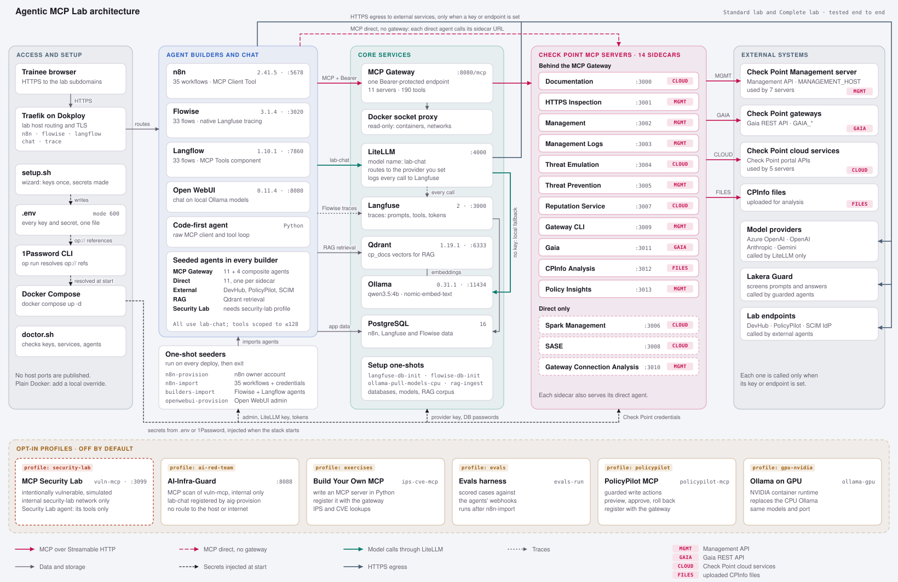

<div align="center">

# Check Point Agentic MCP Lab

**A self-hosted lab for building, tracing, and securing AI agents on Check Point MCP servers.**

[](LICENSE) [](docker-compose.yml) [](docker/n8n/Dockerfile) [](docker-compose.yml) [](docker-compose.yml) [](integrations/litellm/render_config.py) [](mcp-gateway/catalog.yaml)

[Quick start](#quick-start) · [Give keys once](#give-keys-once) · [Learning path](#learning-path) · [Reference](docs/REFERENCE.md)

<picture>
  <source media="(prefers-color-scheme: dark)" srcset="docs/assets/architecture-dark.svg">
  
</picture>
</div>

This lab trains Check Point staff to build AI agents in n8n, Flowise, and Langflow on the Check Point MCP servers. MCP, the Model Context Protocol, is an open standard for how AI agents call tools. One `docker compose up -d` starts the builders, the 14 Check Point MCP servers, one model endpoint, tracing, and RAG. The agents are seeded when the lab starts, so you begin by chatting, not wiring.

## What you get

| Part | What runs |
|---|---|
| **Agent builders** | n8n 2.41.5 with 35 workflows (33 agents, a nightly self-check, and the RAG retriever) and Flowise 3.1.4 with 33 agents. The Complete lab adds Langflow 1.10.1 with the same 33 agents, and Open WebUI for chat |
| **Check Point MCP servers** | 14: Management, Management Logs, Threat Prevention, HTTPS Inspection, Policy Insights, Gateway CLI, Gateway Connection Analysis, Gaia, CPInfo Analysis, Documentation, Threat Emulation, Reputation Service, Spark Management, and SASE |
| **MCP Gateway** | One endpoint for 11 of the servers (190 tools), protected by the Bearer token `MCP_GATEWAY_TOKEN`. Each per-server agent comes in two forms, for example **Management Agent (MCP Gateway)** and **Management Agent (Direct)** |
| **One model, `lab-chat`** | LiteLLM 1.103.1 serves every agent. You choose the provider, and the builders never see its key |
| **Tracing and RAG** | Langfuse 2.95 traces every `lab-chat` call. Qdrant and local `nomic-embed-text` embeddings power the **Documentation RAG Agent** |
| **Opt-in labs** | MCP Security Lab, AI-Infra-Guard, Build Your Own MCP, evals, and PolicyPilot, each behind its own profile |

## Lab components

`./setup.sh` shows the CPUs and memory Docker can use, marks the set this machine can run as recommended, and writes your choice to `COMPOSE_PROFILES` in `.env`.

| | Standard lab (default) | Complete lab |
|---|---|---|
| **`COMPOSE_PROFILES`** | blank | `complete` |
| **Runs** | n8n, Flowise, the MCP Gateway and all Check Point MCP servers, `lab-chat`, Langfuse, and RAG | Everything in the Standard lab, plus Langflow and Open WebUI with local models |
| **Docker needs** | 4 CPUs and 8 GB of memory | 6 CPUs and 16 GB of memory |

Set the resources in Docker Desktop > Settings > Resources. Docker Desktop set to 16 GB reports about 15.1 GB, and setup counts that as 16 GB. With no cloud model key, `lab-chat` runs on a local Ollama model: local models need Docker with 16 GB and run slowly on a CPU. Lab hosts (`DOMAIN` set) use the Complete lab. Add opt-in profiles after a comma, for example `COMPOSE_PROFILES=complete,exercises,security-lab`.

## Quick start

You need Docker Desktop (macOS) or Docker Engine with the Compose plugin (Linux), `git`, and outbound internet access. The lab images are built for amd64 and arm64.

**1. Guided setup (recommended).** Setup asks for the lab components, one model key, and the Check Point keys you have. Typed keys are hidden. It generates every lab secret and writes `.env` with mode 600.

```sh
git clone https://github.com/alshawwaf/cp-agentic-mcp-playground.git
cd cp-agentic-mcp-playground
./setup.sh
docker compose up -d                  # the first start pulls the images
./scripts/doctor.sh --post-start      # 5 to 10 minutes later
tests/acceptance/run.sh               # end-to-end checks
```

**2. Keys in 1Password.** Setup writes `op://vault/item/field` references instead of keys. It asks for the vault and item (default `Private` and `checkpoint-ai-lab`) and lists the fields to create, one per setting name. You need the 1Password CLI (`op`), signed in. Start every later `docker compose` command and lab script with `op run --env-file=.env --`, as below.

```sh
./setup.sh --1password
op run --env-file=.env -- docker compose up -d
op run --env-file=.env -- ./scripts/doctor.sh --post-start
op run --env-file=.env -- tests/acceptance/run.sh
```

**3. Unattended (CI or scripted installs).** No questions. Keys come from environment variables with the names in `.env-example`. Values already in `.env` are kept, and setup fills every blank lab secret.

```sh
cp .env-example .env                                     # optional: fill in the keys you have
COMPOSE_PROFILES=complete ./setup.sh --non-interactive   # blank COMPOSE_PROFILES = the Standard lab
docker compose up -d
```

- **Expected result.** `doctor.sh` ends with `Result: no blockers` and a table of what works with your keys. The acceptance tests print one `PASS`, `FAIL`, or `SKIP` line per check, and checks of profiles that are off show `SKIP`. On a fresh install, the Complete lab with an Azure OpenAI model passed 16 of 20 checks, with no failures. The four skipped checks belong to opt-in profiles.
- **If something fails.** `./scripts/doctor.sh --preflight` checks `.env` and Docker. Each `FAIL` line of `doctor.sh` says what to change, and the acceptance tests print a `fix:` line under each `FAIL`. `tests/acceptance/run.sh --only <ID>` re-runs one check. The Spark Management and SASE servers stop with a "not configured" message until their keys are set, which is expected. [tests/README.md](tests/README.md) explains every check.

## Sign in

One lab admin signs in to every app: `N8N_ADMIN_EMAIL` (default `admin@lab.local`) and `N8N_ADMIN_PASSWORD`, which setup generates. Show it with `grep '^N8N_ADMIN_PASSWORD=' .env`. If you stored the generated secrets in 1Password, `.env` holds an `op://` reference instead: read the value in 1Password. The Standard lab has n8n, Flowise, and Langfuse. The Complete lab adds Langflow and Open WebUI, which uses `OPEN_WEBUI_ADMIN_EMAIL` and `OPEN_WEBUI_ADMIN_PASSWORD` when you set them. The n8n chat pages ask for the same sign-in.

The lab publishes no host ports. On a lab host, the reverse proxy serves the apps at `n8n.<DOMAIN>`, `flowise.<DOMAIN>`, `langflow.<DOMAIN>`, `trace.<DOMAIN>` (Langfuse), and `chat.<DOMAIN>` (Open WebUI). On your own computer, create `docker-compose.override.yml` next to `docker-compose.yml` (git ignores it), then run `docker compose up -d`:

```yaml
services:
  n8n:        { ports: ["127.0.0.1:5678:5678"] }   # http://localhost:5678
  flowise:    { ports: ["127.0.0.1:3020:3020"] }   # http://localhost:3020 (FLOWISE_PORT)
  langfuse:   { ports: ["127.0.0.1:3100:3000"] }   # http://localhost:3100 (LANGFUSE_URL)
  langflow:   { ports: ["127.0.0.1:7860:7860"] }   # Complete lab: http://localhost:7860
  open-webui: { ports: ["127.0.0.1:8080:8080"] }   # Complete lab: http://localhost:8080
```

**First chat.** Open **Management Agent (MCP Gateway)** in n8n or Flowise and ask about your policy. Ask **Management Agent (Direct)** the same question: same tools, no gateway. Both need `MANAGEMENT_HOST` (or `S1C_URL`) and `MANAGEMENT_API_KEY`. An agent whose product is not set answers that it is not configured.

## Give keys once

Every agent in n8n, Flowise, and Langflow uses one model, `lab-chat`, served by LiteLLM at `http://litellm:4000/v1`. Give one provider key. `LAB_MODEL_PROVIDER=auto` (the default) uses the first provider that is fully set, in this order. Set it to `azure`, `openai`, `anthropic`, `gemini`, or `ollama` to choose one.

| Provider | Set in `.env` |
|---|---|
| Azure OpenAI, also behind an Azure API Management gateway | `AZURE_OPENAI_API_KEY`, `AZURE_OPENAI_ENDPOINT`, and `AZURE_OPENAI_DEPLOYMENT` |
| OpenAI | `OPENAI_API_KEY` (`OPENAI_MODEL`, default `gpt-5.1`) |
| Anthropic | `ANTHROPIC_API_KEY` (`ANTHROPIC_MODEL`, default `claude-sonnet-5`) |
| Google Gemini | `GEMINI_API_KEY` (`GEMINI_MODEL`, default `gemini-2.5-flash`) |
| Local Ollama | No key. `OLLAMA_CHAT_MODEL`, default `qwen3.5:4b`. Needs Docker with 16 GB |

- The builders never hold a provider key. They call `lab-chat` with `LITELLM_MASTER_KEY`, which setup generates.
- To change or add a key, edit `.env` (or run `./setup.sh` again), then run `docker compose up -d litellm`. The agents stay as they are.
- Check Point keys are set per product in section 3 of [`.env-example`](.env-example). For example, `MANAGEMENT_HOST` and `MANAGEMENT_API_KEY` give the seven Management-backed servers their access. After a change, run `docker compose up -d`. The MCP servers always verify TLS certificates: for a self-signed Management server or gateway, see [certs/README.md](certs/README.md).

## Learning path

| Step | Guide | You will | Needs |
|---|---|---|---|
| 1 | [MCP Gateway, explained](docs/guides/MCP_Gateway_Explained.md) | Learn what the gateway does, then call it | The Standard lab |
| 2 | [Management](docs/guides/Quantum_Management_MCP_Agent_Guide.md), then [Management Logs](docs/guides/Management_Logs_MCP_Agent_Guide.md), [Threat Prevention](docs/guides/Threat_Prevention_MCP_Agent_Guide.md), [HTTPS Inspection](docs/guides/HTTPS_Inspection_MCP_Agent_Guide.md), [Gaia](docs/guides/Quantum_Gaia_MCP_Agent_Guide.md), [Gateway CLI](docs/guides/Quantum_Gateway_CLI_MCP_Agent_Guide.md), [CPInfo Analysis](docs/guides/CPInfo_Analysis_MCP_Agent_Guide.md), [Documentation](docs/guides/Documentation_MCP_Agent_Guide.md), [Threat Emulation](docs/guides/Threat_Emulation_MCP_Agent_Guide.md), [Reputation Service](docs/guides/Reputation_Service_MCP_Agent_Guide.md) | Query one product at a time in plain language | That product's keys (Management: `MANAGEMENT_HOST` or `S1C_URL`, and `MANAGEMENT_API_KEY`) |
| 3 | [MCP Gateway agents](docs/guides/MCP_Gateway_Agent_Guide.md) | Compare an MCP Gateway agent with its Direct twin, then use the **Check Point MCP Gateway Agent** | Same as step 2 |
| 4 | [Tracing with Langfuse](docs/guides/Observability_Langfuse.md) | Follow each model and tool call in a trace | Nothing extra |
| 5 | [Lakera Guard screening](docs/guides/Lakera_Guard_Screening_Agent_Guide.md) | Screen prompts and answers with Lakera Guard | `LAKERA_API_KEY` |
| 6 | [Visible RAG](docs/guides/Visible_RAG.md), then [Evals](docs/guides/Evals_Harness.md) | Ground answers in documents, then score the agents | Evals: profile `evals` |
| 7 | [Build Your Own MCP Server](docs/guides/Build_Your_Own_MCP_Exercise.md) | Write a server and add it to the gateway | Profile `exercises`, `IPS_CLIENT_ID`, `IPS_ACCESS_KEY` |
| 8 | [MCP Security Lab](docs/guides/MCP_Security_Lab.md) | Attack, detect, and defend an MCP server | Profile `security-lab` |
| 9 | [Identity provisioning (SCIM)](docs/guides/Identity_Provisioning_SCIM_Agent_Guide.md) and [PolicyPilot](docs/guides/PolicyPilot_Gateway_Sidecar_Guide.md) | Create users and request access from a chat | `DOMAIN`, an identity provider at `idp.<DOMAIN>` with `IDP_SCIM_TOKEN`, and PolicyPilot at `policypilot.<DOMAIN>` with `PILOT_MCP_TOKEN`. The sidecar: profile `policypilot` and a PolicyPilot image |
| 10 | [Capstone: Zero Trust onboarding](docs/guides/Capstone_Zero_Trust_Onboarding.md) | Chain identity, access, and guardrails | The setup of steps 5 and 9 |

## From lab to production

| Path | What it shows |
|---|---|
| [Code-first agent](integrations/code-agent/README.md) | The same MCP Gateway and `lab-chat` from plain Python, with no dependencies: a raw MCP client and a tool loop |
| [Amazon Bedrock AgentCore](https://github.com/alshawwaf/checkpoint-mcp-on-aws-agentcore) | Check Point MCP servers and an agent on AWS |
| [Microsoft Foundry](https://github.com/alshawwaf/checkpoint-mcp-on-azure-foundry) | Check Point MCP servers and an agent on Azure |

## Safety

> [!WARNING]
> This is a training lab. Keep it on your own computer or a lab host. Keep `.env` private: it holds every key and secret, only you can read it, and git ignores it. The lab scripts never print a secret. The MCP Security Lab (`security-lab`) and AI-Infra-Guard (`ai-red-team`) are off by default. They run only on internal Docker networks, with no published ports and no public routes. A live test from inside their containers proved they have no route to the Docker host or the internet. Turn them on only for those exercises.

## Reference and license

[docs/REFERENCE.md](docs/REFERENCE.md) holds the detail behind this page. [MIT](LICENSE) © 2025 Check Point Software Technologies Ltd. Bundled third-party components keep their own licenses.
