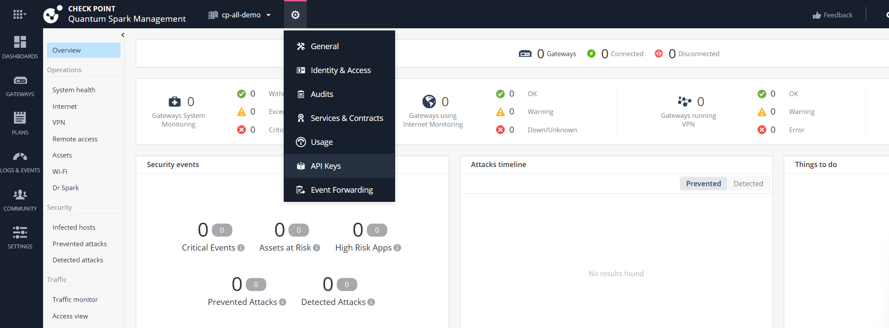
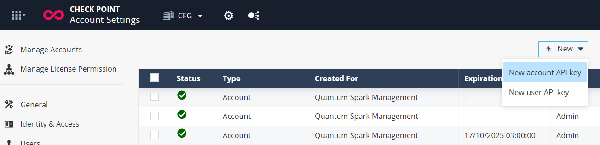
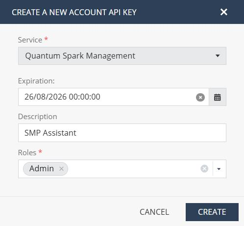
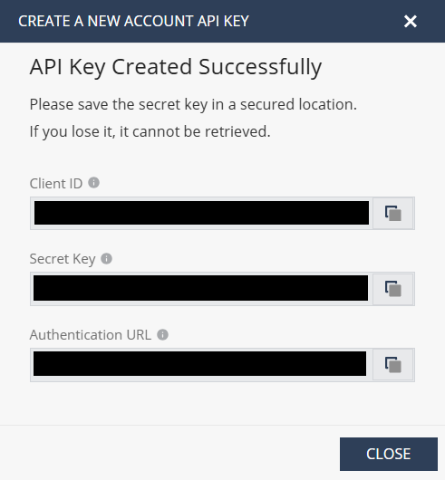

# Check Point Spark Management MCP Server

## What is MCP?

MCP (Model Context Protocol) is an open standard that enables AI agents to interact with external tools, services, and data sources in a secure and structured way. It defines a consistent interface for AI systems to discover and use capabilities such as reading files, querying databases, or sending messages through APIs.

## Why MCP for Spark Management?

The Spark Management provides centralized management and visibility for Check Point's Quantum Spark appliances, designed for MSPs managing small offices, branch offices, and distributed networks. It simplifies deployment, configuration.
 
MCP simplifies interactions with Spark Management data in a structured, modular, and context-rich format that AI systems can understand and utilize. This enables AI to interact intelligently with your Quantum Spark security environment, delivering precise, real-time, and actionable insights based on your queries and interests.

## Features

- Query and analyze gateway configurations and status
- Retrieve device information including software versions, connectivity status, and hardware details
- Manage and inspect gateway and plan administrators
- Access user configurations and permissions
- Get gateway geolocation and deployment information
- Analyze security plans and their applied configurations
- Monitor gateway health and licensing status


## Example Use Cases

### Gateway Status Monitoring
"Show me all gateways and their last connection times to identify any offline devices."  
*→ Returns gateway list with connectivity status, helping identify potential connectivity issues.*

### Security Configuration Audit
"Get the complete configuration for gateway 'office-branch-01' including all security settings and user access."  
*→ Provides comprehensive gateway details including firewall settings, user permissions, and security policies.*

### User Access Management
"List all users configured on gateway 'headquarters' and show their access permissions."  
*→ Returns detailed user information including access levels and configuration status.*

### Plan Configuration Review
"Show me the security plan 'corporate-standard' and all its configured settings."  
*→ Displays complete plan configuration including security policies, user settings, and administrative controls.*

### Device Health Assessment
"Check the software version and licensing status for all gateways to identify devices needing updates."  
*→ Provides version information and license status across the infrastructure.*

### Geolocation Analysis
"Show me the geographic distribution of all deployed gateways."  
*→ Returns location information for physical security infrastructure mapping.*
  
---

## Configuration Options

This server supports configuration via command-line arguments for connecting to Check Point's Spark Management Platform:

### Required Parameters

- `--secret-key`: Your API secret key for authentication
- `--client-id`: Your API client ID for authentication  
- `--region`: The region code (EU, US, STG, LOCAL - default: EU)
- `--infinity-portal-url`: The Infinity Portal URL endpoint

---

## Client Configuration

### Prerequisites

Download and install the latest version of [Node.js](https://nodejs.org/en/download/) if you don't already have it installed.  
You can check your installed version by running:

```bash
node -v      # Should print "v20" or higher
nvm current  # Should print "v20" or higher
```
Receiving Credentials:

Step 1: Open API Keys<br>
Navigate to Quantum Spark Management portal and click on API Keys.
<br>

Step 2: Create New Account API Key<br>
Click New and select New account API key or New user API key.
<br>

Step 3: Fill in API Key Details<br>
Provide the required details such as Service(Quantum Spark Management), Expiration, Description, and Role, then click Create.
<br>

Step 4: Save Your Credentials<br>
Copy and securely store the Client ID, Secret Key, and Authentication URL shown after creation.
<br>

### Supported Clients

This server has been tested with Claude Desktop, Cursor, GitHub Copilot, and Windsurf clients.  
It is expected to work with any MCP client that supports the Model Context Protocol.

### Basic Configuration Example

```json
{
  "mcpServers": {
    "checkpoint-spark-management": {
      "command": "npx",
      "args": [
        "@chkp/spark-management-mcp",
        "--secret-key", "your-secret-key",
        "--client-id", "your-client-id", 
        "--region", "EU",
        "--infinity-portal-url", "your-infinity-portal-url"
      ]
    }
  }
}
```

### Configuring the Claude Desktop App

#### Using a Bundled MCPB (formerly DXT)
1. Download the MCPB file: **[📥 spark-management.mcpb](https://github.com/CheckPointSW/mcp-servers/releases/latest/download/spark-management.mcpb)**
2. Open Claude Desktop App → Settings → Extensions
3. Drag the MCPB file and configure per the instructions.

#### Or Configure Manually

#### For macOS:

```bash
# Create the config file if it doesn't exist
touch "$HOME/Library/Application Support/Claude/claude_desktop_config.json"

# Open the config file in TextEdit
open -e "$HOME/Library/Application Support/Claude/claude_desktop_config.json"
```

#### For Windows:

```cmd
code %APPDATA%\Claude\claude_desktop_config.json
```

Add the server configuration:

```json
{
  "mcpServers": {
    "checkpoint-spark-management": {
      "command": "npx",
      "args": [
        "@chkp/spark-management-mcp",
        "--secret-key", "your-secret-key",
        "--client-id", "your-client-id",
        "--region", "EU", 
        "--infinity-portal-url", "your-infinity-portal-url"
      ]
    }
  }
}
```

### VSCode 

Enter VSCode settings and type "mcp" in the search bar.
You should see the option to edit the configuration file.
Add this configuration:

```json
{
  ...
  "mcp": {
    "inputs": [],
    "servers": {
      "checkpoint-spark-management": {
        "command": "npx",
        "args": [
          "@chkp/spark-management-mcp",
          "--secret-key", "your-secret-key",
          "--client-id", "your-client-id",
          "--region", "EU",
          "--infinity-portal-url", "your-infinity-portal-url"
        ]
      }
    }
  },
  ...
}
```

### Windsurf

Enter Windsurf settings and type "mcp" in the search bar.
You should see the option to edit the configuration file.
Add the configuration as Claude Desktop App.

### Cursor

Enter Cursor settings and click on "MCP Servers" in the left menu.
You should see the option to add a new MCP Server.
Add the configuration as Claude Desktop App.
  
---

## Development

### Prerequisites

- Node.js 20+  
- npm 10+  

### Setup

```bash
# Install all dependencies
npm install
```

### Build

```bash
# Build all packages
npm run build
```

### Running Locally

You can run the server locally for development using [MCP Inspector](https://modelcontextprotocol.io/docs/tools/inspector) or any compatible MCP client.

```bash
# Run the server with required parameters
node /path/to/mcp-servers-internal/packages/spark-management/dist/index.js \
  --secret-key "your-secret-key" \
  --client-id "your-client-id" \
  --region "STG" \
  --infinity-portal-url "your-infinity-portal-url"
```

### Available Tools

The Spark Management MCP server provides the following tools:

#### Gateway Management
- `show_gateway` - Show complete gateway configuration and status
- `show_gateway_fields` - Show specific fields from a gateway
- `show_gateway_attributes` - Show gateway owner and attribute information
- `get_gateway_list` - Get list of all gateways
- `get_gateway_geolocation` - Get geographic location of a gateway

#### Gateway Users & Administrators
- `gateway_get_administrators` - Get all administrators for a gateway
- `gateway_get_administrator` - Get specific administrator details
- `gateway_get_users` - Get all users for a gateway
- `gateway_get_user` - Get specific user details

#### Plan Management
- `show_plan` - Show complete plan configuration
- `show_plan_fields` - Show specific fields from a plan
- `get_plan_list` - Get list of all plans

#### Plan Users & Administrators
- `plan_get_administrators` - Get all administrators for a plan
- `plan_get_administrator` - Get specific administrator details
- `plan_get_users` - Get all users for a plan
- `plan_get_user` - Get specific user details

#### System Information
- `get_settings` - Get portal settings and configuration
- `show_user` - Show user object details

---

## ⚠️ Security Notice

1. **Authentication keys and credentials are never shared with the model.** They are used only by the MCP server to authenticate with your Check Point management system.  
2. **Only use client implementations you trust.** Malicious or untrusted clients could misuse your credentials or access data improperly.  
3. **Management data is exposed to the model.** Ensure that you only use models and providers that comply with your organization’s policies for handling sensitive data and PII.
