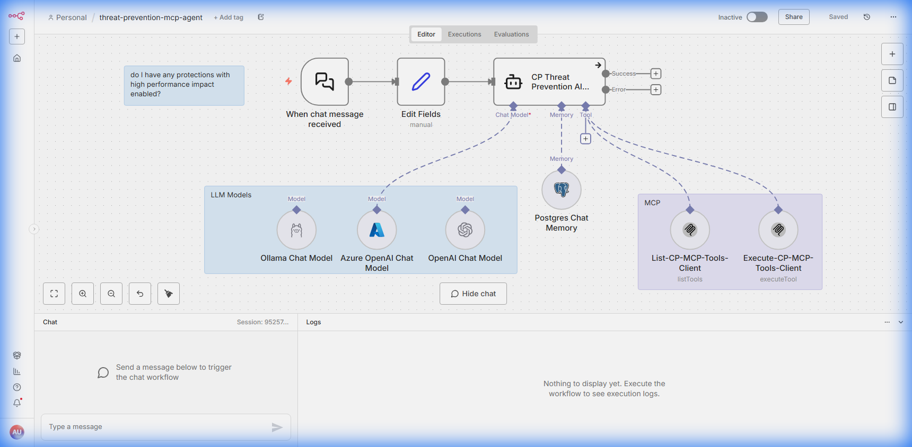

# Threat Prevention Agent Guide

This guide details the **Threat Prevention Agent** workflow, designed to autonomously manage and monitor threat prevention policies using Check Point's Management API.

## Overview

The **Threat Prevention Agent** is an intelligent automation workflow that interacts with the Check Point Management Server. It utilizes an LLM (Large Language Model) to interpret user requests and execute complex security operations, such as:

*   Retrieving threat prevention profiles.
*   Analyzing protection statuses.
*   Managing IPS protections.
*   Installing policies.

## Workflow Deep Dive

This section breaks down the workflow into its core components, explaining the purpose and configuration of each node.

### 1. The Brain: AI Agent
*   **Node Name**: `Threat Prevention Agent`
*   **Type**: `@n8n/n8n-nodes-langchain.agent`
*   **Purpose**: This is the central intelligence of the workflow. It receives the user's natural language request (e.g., "Show me all active IPS protections") and decides which tools to call to fulfill that request.
*   **Configuration**:
    *   **System Message**: configured to act as a security expert.
    *   **Model**: Connected to a powerful LLM (e.g., Gemini or OpenAI) to understand context and intent.

### 2. The Tools: MCP Client
*   **Node Name**: `MCP Client`
*   **Type**: `@n8n/n8n-nodes-langchain.mcpClientTool`
*   **Purpose**: Connects the AI Agent to the **Model Context Protocol (MCP)** server for Threat Prevention. This server exposes specific security functions as "tools" the AI can use.
*   **Capabilities**:
    *   `show-protections`: List available IPS protections.
    *   `show-profiles`: Retrieve threat prevention profiles.
    *   `install-policy`: Deploy changes to the gateway.
    *   `run-command`: Execute generic management API commands.

### 3. Memory Management
*   **Node Name**: `Window Buffer Memory`
*   **Type**: `@n8n/n8n-nodes-langchain.memoryBufferWindow`
*   **Purpose**: Maintains the context of the conversation. This allows the agent to remember previous questions and answers, enabling multi-turn conversations (e.g., "List the profiles" -> "Now show me details for the first one").

### 4. Input Trigger
*   **Node Name**: `When chat message received`
*   **Type**: `@n8n/n8n-nodes-langchain.chatTrigger`
*   **Purpose**: Listens for incoming chat messages from the user interface and starts the workflow execution.

## How It Works

1.  **User Request**: You send a message like "Find all protections related to 'Log4j'".
2.  **Intent Analysis**: The **AI Agent** analyzes the request and determines it needs to use the `show-protections` tool with a filter for "Log4j".
3.  **Tool Execution**: The **MCP Client** executes the command against the Check Point Management Server via the MCP server.
4.  **Response Generation**: The raw data from the Management Server is returned to the AI Agent, which summarizes it into a human-readable response.
5.  **Reply**: The agent sends the formatted answer back to the chat.

## Best Practices

*   **Specific Requests**: The more specific your request, the better the agent can filter the data (e.g., instead of "show protections", try "show active protections with high severity").
*   **Verify Actions**: For critical actions like `install-policy`, always verify the changes in the Management Console or ask the agent to confirm the details before execution.
*   **Context Usage**: Leverage the memory by asking follow-up questions. If you just retrieved a list of profiles, you can say "export *that* list to JSON" without restating the whole query.
